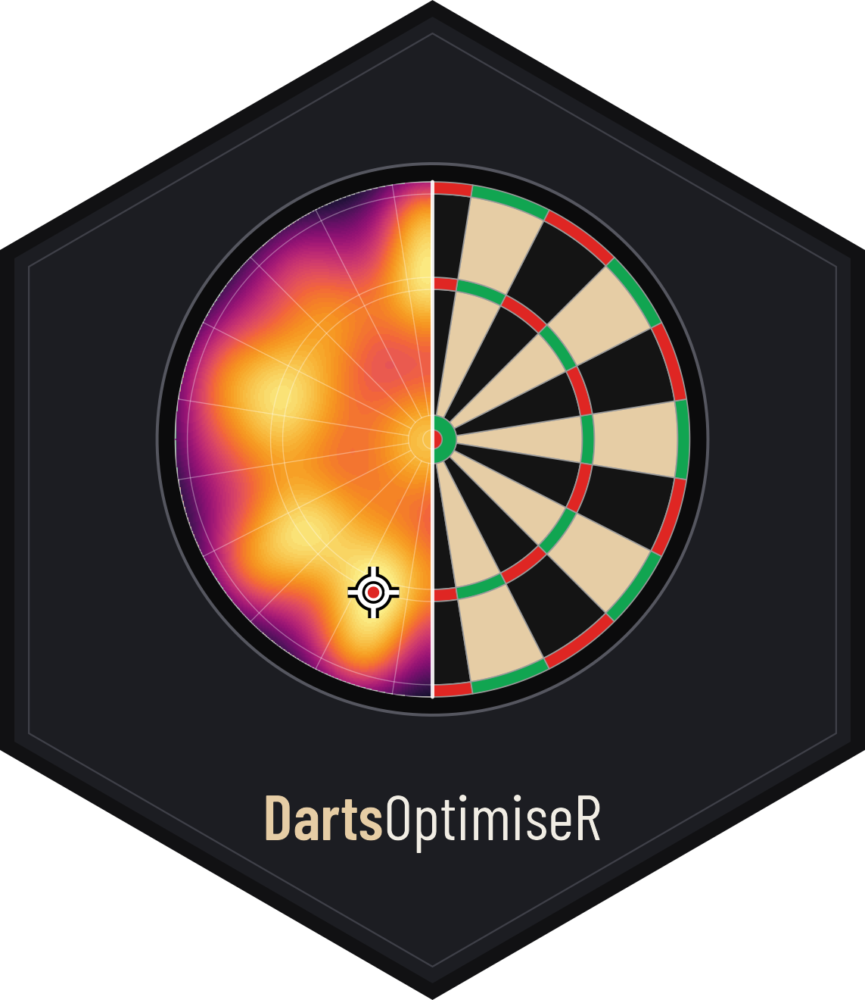
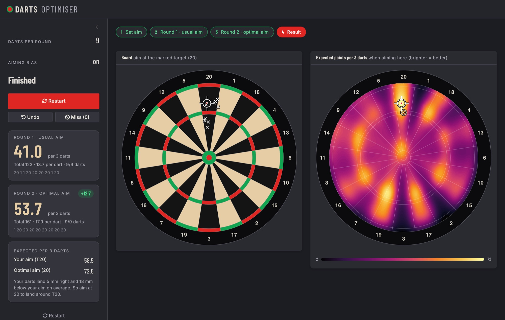

# {DartsOptimiseR} 

Me and my uni-friends recently started playing darts. As we are quite
bad (i.e. our throws have a large standard deviation) we asked ourselves
if it is better to aim at the bullseye or triple twenty. Then
generalised the question even more: Given your skill level, what target
should you choose to maximise your expected points on three darts?

The code provided here can be used to answer this question. It estimates
how your throws scatter from the throws you enter and computes the
expected score for every possible aim point: a convolution of the
dartboard’s score map with a bivariate normal distribution, done via
FFT. For details, see Tibshirani et al. (2010).

## Classroom app

We use this in the first week of the semester to show students how
statistics can improve their darts game. The app in
[`classroom/`](classroom/app.R) runs the whole experiment.

Try it [online](https://janoleko.shinyapps.io/Darts2/), or run it
locally, which is noticeably faster:

``` r
install.packages(c("shiny", "bslib"))
shiny::runGitHub("DartsOptimizeR", "janolefi", subdir = "classroom")
```

It works in three steps:

1.  **Set aim**: choose how many darts per round and mark where you
    usually aim (T20 by default).
2.  **Round 1**: throw at your usual aim and click where each dart
    lands. Scores are counted automatically, and from the third dart on
    the heatmap of expected points updates live.
3.  **Round 2**: the app marks the optimal target for your spread; aim
    there and compare your average per three darts.

Optionally, the app also accounts for **aiming bias**: if your darts
land, say, 15 mm left of where you aim on average, the optimal target is
shifted to compensate. This can be switched off.



<!-- ## Original app -->

<!-- The original, simpler app lives in [`app.R`](app.R): enter your throws and get the heatmap of the optimal target. See it [here](https://janoleko.shinyapps.io/DartsOptimizeR/). -->

<!--  -->
